## Software: [GrimoireLab](https://grimoirelab.github.io/)
 - example: [OPNFV dashboard](https://opnfv.biterg.io)

_TODO: Provide a brief description here._

### Metrics

GrimoireLab measures a number of metrics for a number of different platforms. A short, non-comprehensive list includes:

* General:
  * Identities
* Github:
  * Assignee Organizations
  * Attracted/Leaving Developers
  * Backlog (Open PRs and Issues)
  * Commits by Timezone
  * Issue Submitters
  * Pull Request 80% Open Time
  * Pull Request Status
  * Pull Request Submitters
  * Pull Requests by Organization
  * Top Authors
  * Top Repositories
* Gerrit:
  * Changeset Status
* Mailing Lists:
  * Emails

#### Identities
Tracks the same user across multiple profiles

#### Assignee Organizations
Counts the issues assigned to individual organizations

#### Attracted/Leaving Developers
Counts new developers making commits to the project by month and the number of developers who made their last commit 6 months ago

#### Backlog (Open PRs and Issues)
Listing of all open issues and pull requests

#### Commits By Timezone
Counts how many commits have originated from each timezone

#### Issue Submitters
List of everyone who has opened an issue to a project, along with number of issues, number of repositories, and average length their issues remain open

#### Pull Request 80% Open Time
Duration it takes for 80% of pull requests to be closed from a specific month/day

#### Pull Request Status
Count of open and closed pull requests

#### Pull Request Submitters
Count of individual pull request submitters by date

#### Pull Request By Organization
Count of pull request by developers associated with a particular organization

#### Top Authors
Measures how many commits each author has made, lines added/removed in their commits, and how many projects they have contributed to

#### Top Repositories
Measures activity (commits, authors, lines of code, etc.) of multiple scanned repositories

#### Gerrit: Changeset Status
Counts the number of changesets by status

#### Mailing Lists: Emails
Counts the emails send on mailing lists associated with the project

### Data Visualization Examples

#### Identities
```
mysql -u user -pXXX -e 'SELECT * FROM identities;' shdb
| id      | name                           | email                                | username | source | uuid    |
| 0cac4ef | Quan Zhou                      | quan@bitergia.com                    | NULL     | git    | 0cac4ef |
| 0ef1c4a | Jesus M. Gonzalez-Barahona     | jgbarah@gmail.com                    | NULL     | git    | 0ef1c4a |
| 11cc034 | quan                           | zhquan7@gmail.com                    | NULL     | git    | 11cc034 |
| 35c0421 | Alberto Martín                 | alberto.martin@bitergia.com          | NULL     | git    | 35c0421 |
| 37a8187 | Alberto Martín                 | albertinisg@users.noreply.github.com | NULL     | git    | 37a8187 |
| 3ca4e85 | Daniel Izquierdo Cortazar      | dicortazar@gmail.com                 | NULL     | git    | 3ca4e85 |
| 4fcec5a | dpose                          | dpose@sega.bitergia.net              | NULL     | git    | 4fcec5a |
| 5b358fc | dpose                          | dpose@bitergia.com                   | NULL     | git    | 5b358fc |
| 692ad15 | Andre Klapper                  | a9016009@gmx.de                      | NULL     | git    | 692ad15 |
| 6dcf98c | Daniel Izquierdo               | dizquierdo@bitergia.com              | NULL     | git    | 6dcf98c |
| 75fc28e | Santiago Dueñas                | sduenas@bitergia.com                 | NULL     | git    | 75fc28e |
| 7ad0031 | Alvaro del Castillo            | acs@thelma.cloud                     | NULL     | git    | 7ad0031 |
| 8fac15f | alpgarcia                      | alpgarcia@gmail.com                  | NULL     | git    | 8fac15f |
| 9aed245 | Alvaro del Castillo            | acs@bitergia.com                     | NULL     | git    | 9aed245 |
...
```

#### Assignee Organizations
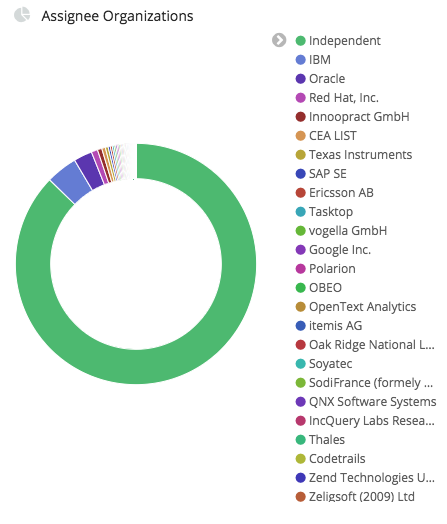

#### Attracted/Leaving Developers
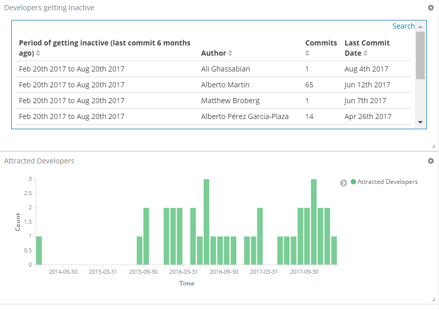

#### Backlog (Open PRs and Issues)
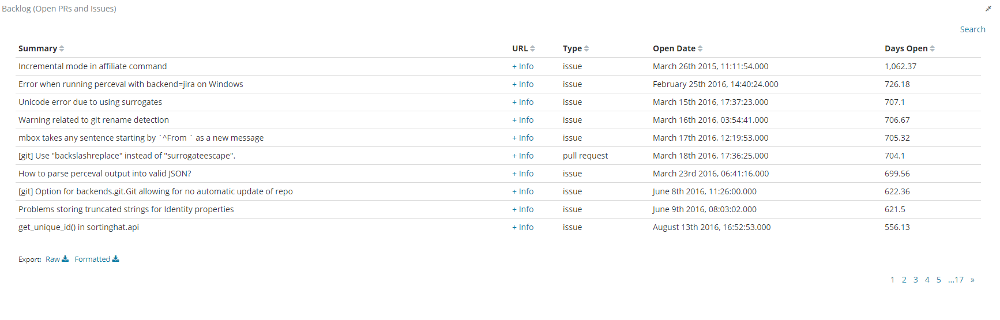

#### Commits By Timezone
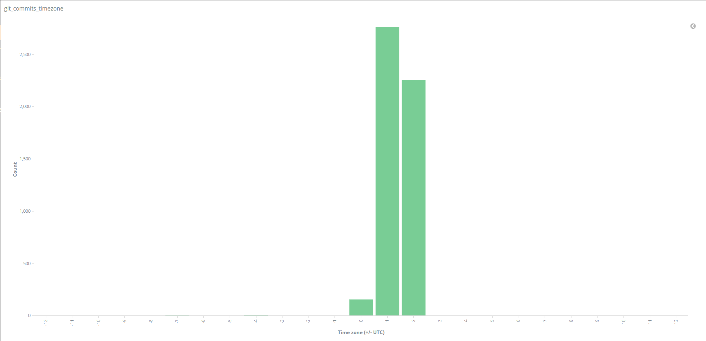

#### Issue Submitters
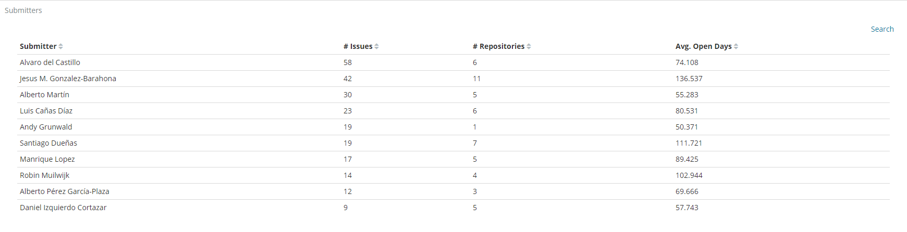

#### Pull Request 80% Open Time
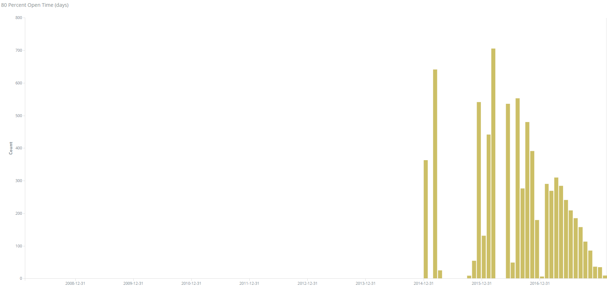

#### Pull Request Status
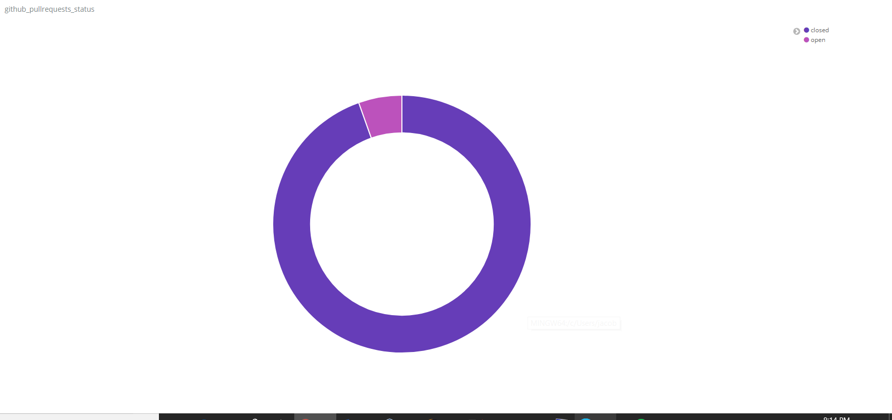

#### Pull Request Submitters
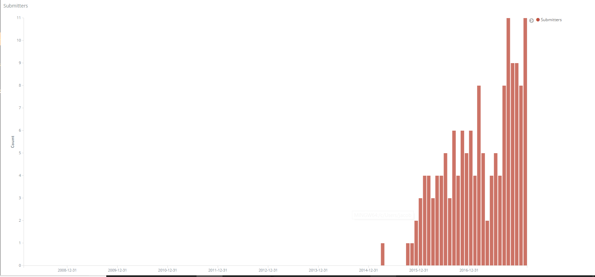

#### Pull Request By Organization
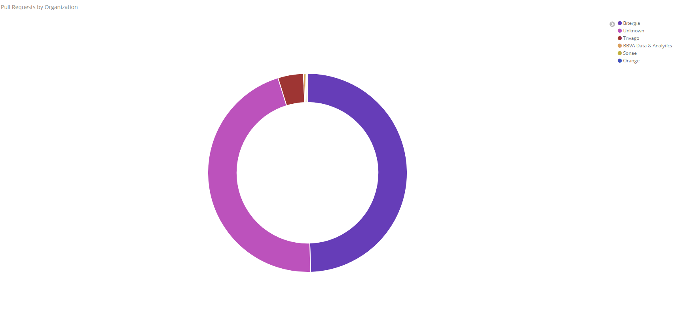

#### Top Authors
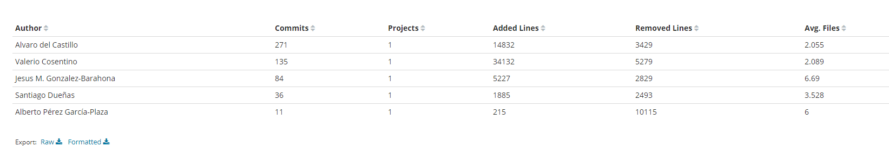

#### Top Repositories
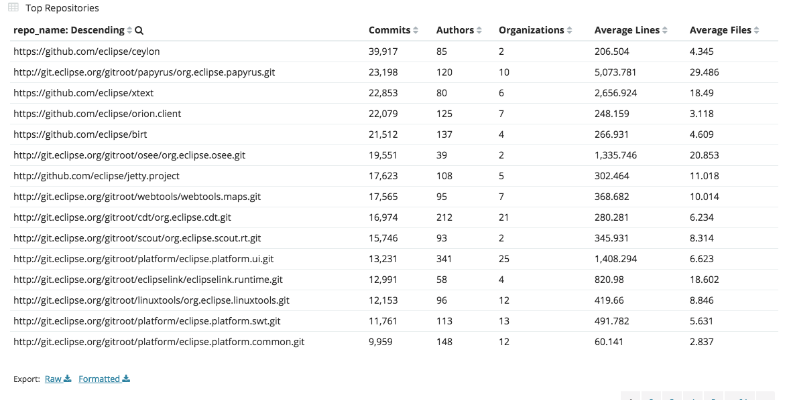

#### Gerrit: Changeset Status
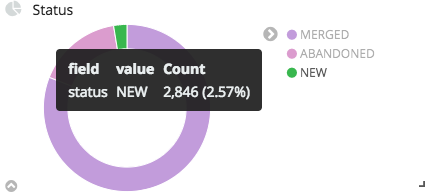

#### Mailing Lists: Emails
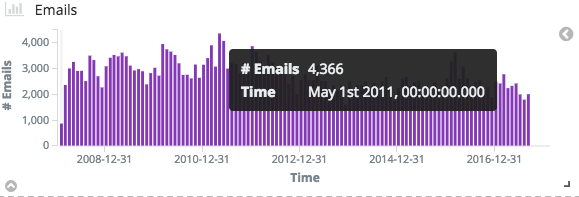
