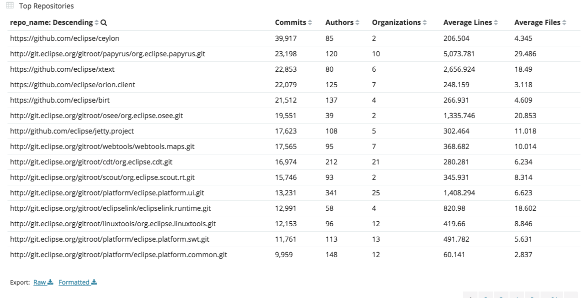
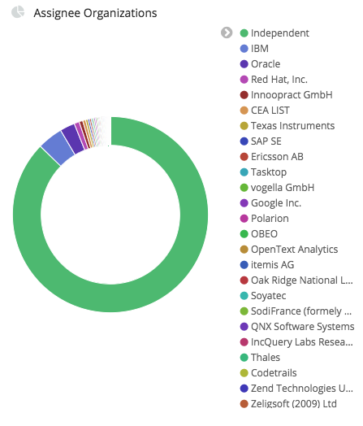
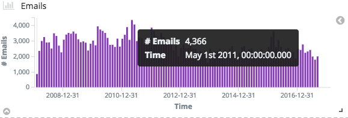
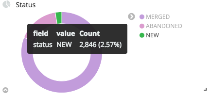

# GrimoireLab Metrics

A non-comprehensive set of metrics measured by GrimoireLab

* Top Authors:
  * What: Measures how many commits they've made, lines added/removed in their commits, how many projects they work on
  * Why: Shows who's making the most contributions/how active they are in the community. Gives a good idea of who people should talk to for issues or add to the core team
  * 
* Attracted/Leaving Developers:
  * What (Attracted): Counts new developers making commits to the project by month
  * What (Leaving): Counts developers who made their last commit 6 months ago
  * Why: Shows how many new developers are contributing to the project versus developers who have gone inactive in the project
  * 
* Issue Submitters:
  * What: List of everyone who has opened an issue to a project, along with number of issues, number of repositories, and average length their issues remain open.
  * Why: Shows the variety of submitters, how active they are, and how quickly their issues are resolved. Indicates the variety of perspectives and opinions contributing to the project
  * 
* Pull Request By Organization:
  * What: Count of pull request by developers associated with a particular organization
  * Why: Shows ownership and support of the project by organizations.
  * 
* 80% Open Time (days):
  * What: Amount of time it takes for 80% of pull requests to be closed from a specific month/day
  * Why: Shows how responsive project managers are with accepting/denying pull requests
  * 
* Identities
  * What: Track the same user across multiple profiles
  * Why: Prevents over-counting individual developers and allows more accurate identification of important developers
  * (no UI available)
```
mysql -u user -pXXX -e 'SELECT * FROM identities;' shdb
| id      | name                           | email                                | username | source | uuid    |
| 0cac4ef | Quan Zhou                      | quan@bitergia.com                    | NULL     | git    | 0cac4ef |
| 0ef1c4a | Jesus M. Gonzalez-Barahona     | jgbarah@gmail.com                    | NULL     | git    | 0ef1c4a |
| 11cc034 | quan                           | zhquan7@gmail.com                    | NULL     | git    | 11cc034 |
| 35c0421 | Alberto Martín                 | alberto.martin@bitergia.com          | NULL     | git    | 35c0421 |
| 37a8187 | Alberto Martín                 | albertinisg@users.noreply.github.com | NULL     | git    | 37a8187 |
| 3ca4e85 | Daniel Izquierdo Cortazar      | dicortazar@gmail.com                 | NULL     | git    | 3ca4e85 |
| 4fcec5a | dpose                          | dpose@sega.bitergia.net              | NULL     | git    | 4fcec5a |
| 5b358fc | dpose                          | dpose@bitergia.com                   | NULL     | git    | 5b358fc |
| 692ad15 | Andre Klapper                  | a9016009@gmx.de                      | NULL     | git    | 692ad15 |
| 6dcf98c | Daniel Izquierdo               | dizquierdo@bitergia.com              | NULL     | git    | 6dcf98c |
| 75fc28e | Santiago Dueñas                | sduenas@bitergia.com                 | NULL     | git    | 75fc28e |
| 7ad0031 | Alvaro del Castillo            | acs@thelma.cloud                     | NULL     | git    | 7ad0031 |
| 8fac15f | alpgarcia                      | alpgarcia@gmail.com                  | NULL     | git    | 8fac15f |
| 9aed245 | Alvaro del Castillo            | acs@bitergia.com                     | NULL     | git    | 9aed245 |
...
```
* Top Repositories
  * What: Measures activity (commits, authors, lines of code, etc.) of multiple scanned repositories
  * Why: Provides a relative view of repositories within a project to see where activity is concentrated
  * 
* Assignee Organizations
  * What: Counts the issues assigned to individual organizations
  * Why: Can indicate which organizations are valued by the community itself
  * 
* Mailing Lists: Emails
  * What: Counts the emails send on mailing lists associated with the project
  * Why: Indicates how responsive the mailing lists are via volume of traffic
  * 
* Gerrit: Changeset Status
  * What: Counts the changesets of each status
  * Why: Can indicate the current stage of development that the project is in (i.e. a project ramping up for a new release may have more DRAFT issues than NEW)
  * 
* Backlog (Open PRs and Issues)
  * What: Listing of all open issues and pull requests
  * Why: Shows that a community is active by having a lot of issues and pull requests, can also show inactivity of community managers if too many issues or pull requests aren't being resolved
  * 
* Pull Request Submitters
  * What: Count of individual pull request submitters by date
  * Why: Shows activity level of the community for making updates/fixes
  * 
* Top Repositories
  * What: Listing of the most active repositories with metrics for each
  * Why: Shows which repositories within the project are getting the most attention and can help steer development
  * 
* Pull Request Status
  * What: Graphic showing amount of open and closed pull requests
  * Why: Shows quickly how many open requests are in contrast to closed requests. This information can be used to see if a community is letting open requests pile up
  * 
